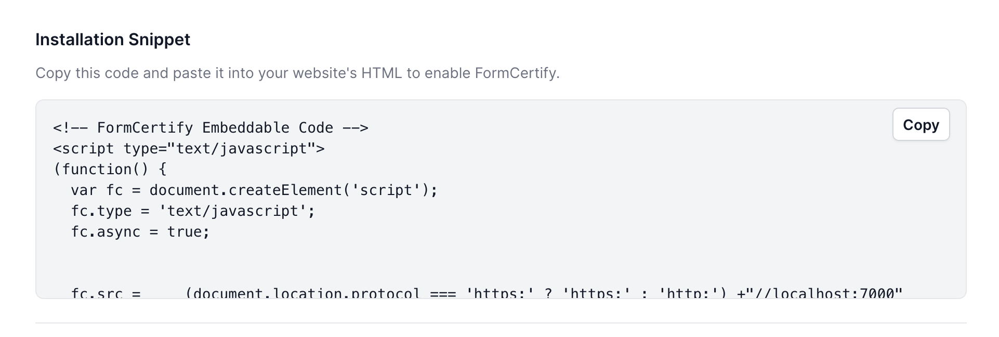

## Install snippet on your website

Go to [https://formcertify.com/settings](https://formcertify.com/settings) to find your snippet.

Place the snippet on your website right before the end `</body>` tag. It should be present on all pages that you have web forms and want to generate consent certificates.

<CardGroup>
  <Card title="Style Your Docs" icon="paintbrush" href="/settings/global">
    Add flair to your docs with personalized branding.
  </Card>

  <Card title="Add API Endpoints" icon="square-code" href="/api-playground/configuration">
    Implement your OpenAPI spec and enable API user interaction.
  </Card>

  <Card title="Integrate Analytics" icon="chart-mixed" href="/analytics/supported-integrations">
    Draw insights from user interactions with your documentation.
  </Card>

  <Card title="Host on a Custom Domain" icon="browser" href="/settings/custom-domain/subdomain">
    Keep your docs on your own website's subdomain.
  </Card>
</CardGroup>